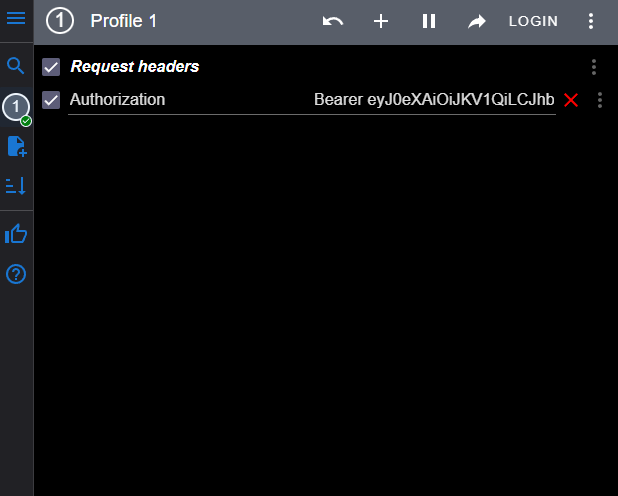

# Cinema API
<hr>

#### API service for cinema management 

## Installing using GitHub
<hr>
Install PostgresSQL and create datebase

```
git clone git@github.com:Splend1ed/cinema-app.git
```
In project directory:
```
python -m venv venv

source venv/Scripts/activate (on Windows)
source venv/bin/activate (on Linux)

pip install -r requirements.txt

export DB_HOST=<your db host name>
export DB_NAME=<your db name>
export DB_USER=<your db user name>
export DB_PASSWORD=<your db user password>

python manage.py migrate
```
You can create admin user in CLI
```
python manage.py createsuperuser
```
Run on localhost (127.0.0.1:8000)
```
python manage.py runserver
```
## Getting access:
<hr>

```
127.0.0.1:8000/api/user/token/ (copy access token and enter in header)
```
For simple use you can add extension in your browser and fill token like this:



[Add extension](https://chrome.google.com/webstore/detail/modheader/idgpnmonknjnojddfkpgkljpfnnfcklj?hl=uk) (Chrome browser)

### Documentation:
```
127.0.0.1:8000/api/doc/swagger/
```

## Run with docker
<hr>

#### Docker should be installed

```
docker-compose build
docker-compose up
```


